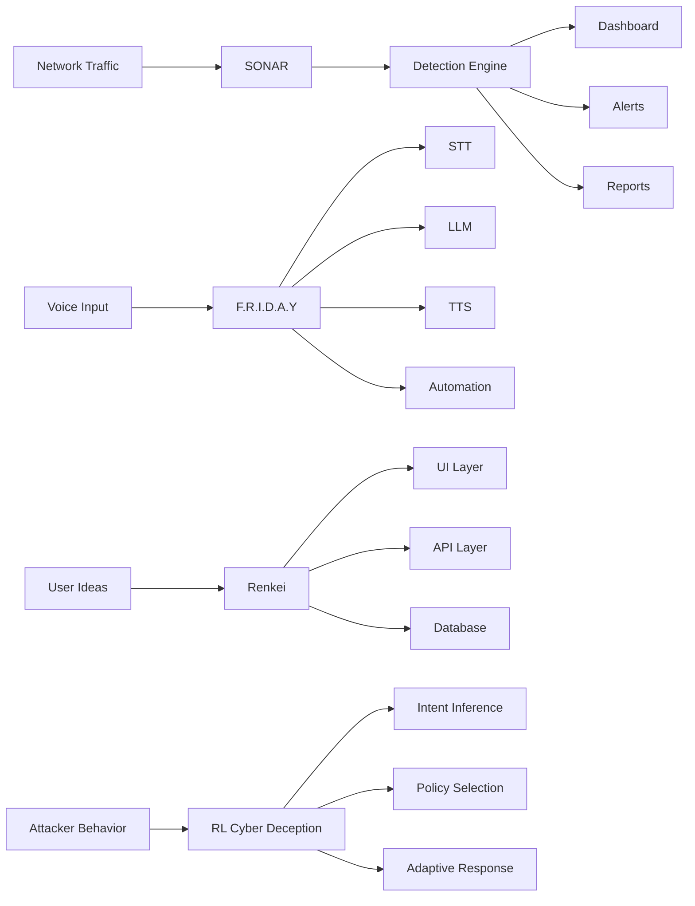
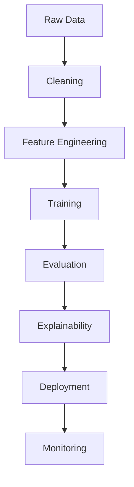

<!-- ========================= -->
<!--          HEADER           -->
<!-- ========================= -->

<p align="center">
  
</p>

<p align="center">
  
</p>

<p align="center">
  
  
  <a href="https://aixart-sjv.github.io">
    
  </a>
  <a href="https://github.com/aIxart-sjv">
    
  </a>
  <a href="mailto:your@email.com">
    
  </a>
</p>

<p align="center">
  
</p>

---

##  LIVE CONSOLE

<table>
<tr>
<td width="60%" valign="top">

```console
$ whoami

SITTI JAIVARDHAN

$ neofetch

┌─────────────────────────────────────────────┐
│ OS      : Arch Linux                        │
│ WM      : Hyprland                          │
│ Shell   : Fish                              │
│ Editor  : VS Code                           │
│ Stack   : Python • TS • JS • C++ • Java     │
│ Focus   : AI • Security • RL • Networks     │
│ Status  : ONLINE                            │
└─────────────────────────────────────────────┘
```

</td>
<td width="40%" valign="top">


</td>
</tr>
</table>

<p align="center">
  
</p>

---

##  PROFILE

```yaml
name: SITTI JAIVARDHAN
role:
  - AI Engineer
  - Cybersecurity Researcher
  - Open Source Developer
location: India
status: building
core_interests:
  - Artificial Intelligence
  - Cybersecurity
  - Reinforcement Learning
  - Network Defense
  - Explainable AI
work_style:
  - research first
  - ship useful tools
  - keep it reproducible
environment:
  - Arch Linux
  - Hyprland
  - Fish Shell
  - VS Code
```

<p align="center">
  
</p>

---

##  PROJECTS

<table>
<tr>
<td width="50%" valign="top">

### [SONAR](https://github.com/aIxart-sjv/SONAR)
AI-powered network intrusion detection and traffic analysis.

- ML-based detection
- Security analytics
- Dashboard-driven insight
- Research-oriented workflow

</td>
<td width="50%" valign="top">

### [F.R.I.D.A.Y](https://github.com/aIxart-sjv/F.R.I.D.A.Y)
Personal AI assistant with voice, automation, and local models.

- Voice interaction
- STT / TTS pipeline
- Local LLM integration
- Desktop-first assistant

</td>
</tr>
<tr>
<td width="50%" valign="top">

### [Renkei](https://github.com/aIxart-sjv/Renkei)
AI-powered innovation platform for ideas, execution, and workflow.

- Full-stack architecture
- FastAPI backend
- Modern UI
- Productivity focused

</td>
<td width="50%" valign="top">

### [Hybrid-Network-Congestion-Framework](https://github.com/aIxart-sjv/Hybrid-Network-Congestion-Framework)
Predict congestion early and recommend traffic actions.

- Congestion forecasting
- Severity classification
- Explainable ML
- Adaptive traffic management

</td>
</tr>
</table>

<p align="center">
  
  
</p>

<p align="center">
  
  
</p>

<p align="center">
  
</p>

---

##  STACK

<p align="center">
  
</p>

<p align="center">
  
</p>

<p align="center">
  
  
  
  
  
</p>

---

##  FOCUS AREAS

<p align="center">
  
  
  
  
  
  
  
</p>

<p align="center">
  
</p>

---

##  ACTIVE WORK

<table>
<tr>
<td width="50%" valign="top">

**SONAR**
- improve detection quality
- expand evaluation
- clean architecture
- keep it publishable

**F.R.I.D.A.Y**
- make the assistant sharper
- improve speech pipeline
- reduce friction
- stop it from becoming bloated junk

</td>
<td width="50%" valign="top">

**Renkei**
- polish the product
- keep the UI crisp
- strengthen backend structure
- make the repo portfolio-grade

**RL Cyber Deception**
- attacker intent modeling
- adaptive policy selection
- deception strategy design
- publishable novelty, not fluff

</td>
</tr>
</table>

<p align="center">
  
  
  
</p>

---

##  MAP

<details open>
<summary><b>Click to collapse</b></summary>



</details>

<details>
<summary><b>Research pipeline</b></summary>



</details>

<p align="center">
  
</p>

---

##  ACTIVITY DASHBOARD

<p align="center">
  
  
</p>

<p align="center">
  
</p>

<p align="center">
  
</p>

---

##  SUMMARY CARDS

<p align="center">
  
</p>

<p align="center">
  
  
</p>

<p align="center">
  
  
</p>

---

##  TROPHIES

<p align="center">
  
</p>

<p align="center">
  
</p>

---

##  ROADMAP

```text
2023  -> Started AI and systems building
2024  -> Open source projects and research growth
2025  -> SONAR, F.R.I.D.A.Y, Renkei
2026  -> RL Cyber Deception and stronger publication work
Future -> Autonomous cyber defense systems
```

---

##  CONTRIBUTION PACMAN

<p align="center">
  
</p>

<p align="center">
  
</p>

---

##  SNAKE

<p align="center">
  
</p>

---

##  SIGNALS

<p align="center">
  
  
  
  
  
  
  
  
</p>

---

##  MANTRA

<p align="center">
  <i>Build systems that work, not just systems that look impressive.</i>
</p>

<p align="center">
  <i>If it cannot be explained, measured, or reproduced, it is not finished.</i>
</p>

<p align="center">
  
</p>
