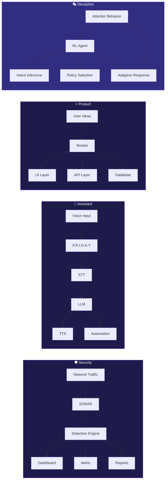
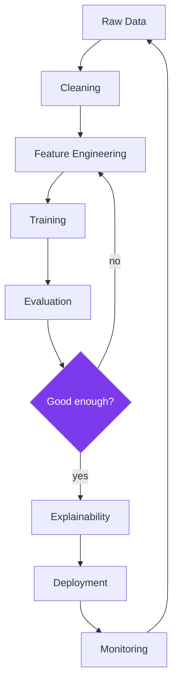
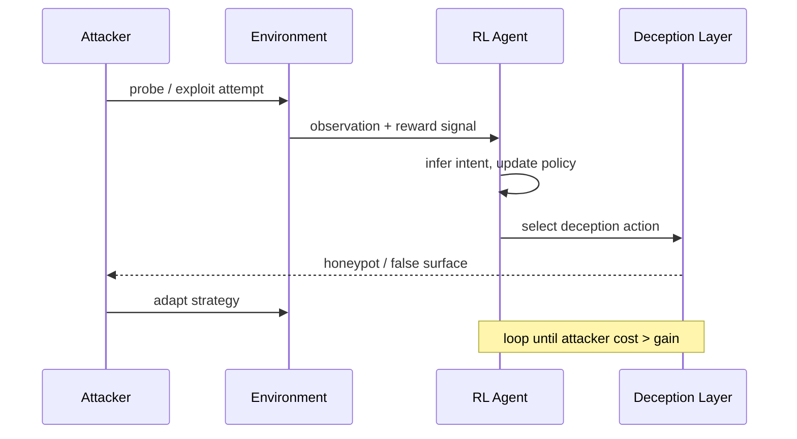
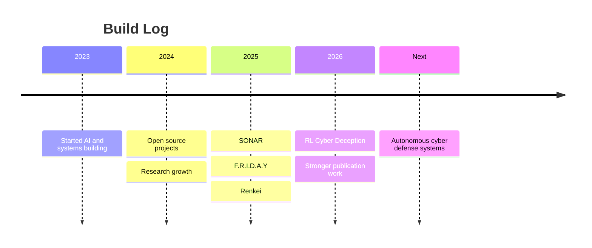

<!-- ============================================================ -->
<!--                          HEADER                             -->
<!-- ============================================================ -->

<p align="center">
  
</p>

<p align="center">
  <a href="https://aixart-sjv.github.io">
    
  </a>
</p>

<p align="center">
  
</p>

<p align="center">
  <a href="https://github.com/aIxart-sjv?tab=followers">
    
  </a>
  
  <a href="https://aixart-sjv.github.io">
    
  </a>
  <a href="mailto:your@email.com">
    
  </a>
</p>

<p align="center">
  
</p>

<!-- ============================================================ -->
<!--                     01 — LIVE CONSOLE                       -->
<!-- ============================================================ -->

## 

<table>
<tr>
<td width="58%" valign="top">

```console
$ whoami
SITTI JAIVARDHAN

$ neofetch --minimal
┌──────────────────────────────────────────────┐
│  OS       :  Arch Linux                      │
│  WM       :  Hyprland                        │
│  SHELL    :  Fish                            │
│  EDITOR   :  VS Code / Neovim                │
│  STACK    :  Python • TS • C++ • Java        │
│  FOCUS    :  AI • Security • RL • Networks   │
│  UPTIME   :  ████████████████████░░  92%     │
│  STATUS   :  ● ONLINE — compiling something  │
└──────────────────────────────────────────────┘

$ cat /proc/current_thought
"Deception is just a control policy
 the attacker hasn't modeled yet."

$ _
```

</td>
<td width="42%" valign="top">


</td>
</tr>
</table>

<p align="center">
  
</p>

<!-- ============================================================ -->
<!--                       02 — PROFILE                          -->
<!-- ============================================================ -->

## 


```yaml
identity:
  name:     Sitti Jaivardhan
  location: India  🇮🇳
  status:   building

roles:
  - AI Engineer
  - Cybersecurity Researcher
  - Open Source Developer

core_interests:
  - Artificial Intelligence
  - Cybersecurity
  - Reinforcement Learning
  - Network Defense
  - Explainable AI

work_style:
  - research first
  - ship useful tools
  - keep it reproducible

environment:
  - Arch Linux + Hyprland
  - Fish Shell
  - VS Code
```

<br clear="right"/>

<p align="center">
  
</p>

<!-- ============================================================ -->
<!--                    03 — FEATURED PROJECTS                   -->
<!-- ============================================================ -->

## 

<p align="center">
  
</p>

<table>
<tr>
<td width="50%" valign="top">

### 🛰️ [SONAR](https://github.com/aIxart-sjv/SONAR)
> AI-powered network intrusion detection and traffic analysis.

`ML detection` `security analytics` `dashboards` `research-grade eval`

<a href="https://github.com/aIxart-sjv/SONAR">
  
</a>

</td>
<td width="50%" valign="top">

### 🤖 [F.R.I.D.A.Y](https://github.com/aIxart-sjv/F.R.I.D.A.Y)
> Personal AI assistant with voice, automation, and local models.

`STT/TTS` `local LLM` `automation` `desktop-first`

<a href="https://github.com/aIxart-sjv/F.R.I.D.A.Y">
  
</a>

</td>
</tr>
<tr>
<td width="50%" valign="top">

### ⚡ [Renkei](https://github.com/aIxart-sjv/Renkei)
> AI-powered innovation platform for ideas, execution, and workflow.

`FastAPI` `full-stack` `modern UI` `productivity`

<a href="https://github.com/aIxart-sjv/Renkei">
  
</a>

</td>
<td width="50%" valign="top">

### 🌐 [Hybrid Congestion Framework](https://github.com/aIxart-sjv/Hybrid-Network-Congestion-Framework)
> Predict congestion early and recommend traffic actions.

`forecasting` `severity classes` `explainable ML` `adaptive control`

<a href="https://github.com/aIxart-sjv/Hybrid-Network-Congestion-Framework">
  
</a>

</td>
</tr>
</table>

<p align="center">
  
</p>

<!-- ============================================================ -->
<!--                     04 — TECH ARSENAL                       -->
<!-- ============================================================ -->

## 

<p align="center">
  
  <br/><br/>
  
  <br/><br/>
  
</p>

<details>
<summary><b>⚙️ &nbsp;Proficiency breakdown — click to expand</b></summary>
<br/>

```text
Python        ███████████████████░  95%   ai • backend • research tooling
PyTorch       ██████████████████░░  90%   models • training loops • RL
FastAPI       █████████████████░░░  88%   services • APIs • async
TypeScript    ████████████████░░░░  82%   frontend • tooling
React/Next    ███████████████░░░░░  78%   dashboards • product UI
C / C++       ██████████████░░░░░░  72%   systems • performance
Linux / Arch  ███████████████████░  93%   daily driver • Hyprland rice
Networking    █████████████████░░░  86%   traffic analysis • defense
```

</details>

<p align="center">
  
</p>

<!-- ============================================================ -->
<!--                   05 — RESEARCH FOCUS                       -->
<!-- ============================================================ -->

## 

<p align="center">
  
  
  
  <br/>
  
  
  
  
</p>

<p align="center">
  
  
  
  
</p>

<p align="center">
  
</p>

<!-- ============================================================ -->
<!--                    06 — ACTIVE MISSION                      -->
<!-- ============================================================ -->

## 

<p align="center">
  
</p>

<table>
<tr>
<td width="50%" valign="top">

#### 🛰️ SONAR
```diff
+ improve detection quality
+ expand evaluation suite
+ clean architecture
! keep it publishable
```

#### 🤖 F.R.I.D.A.Y
```diff
+ sharper assistant reasoning
+ better speech pipeline
- reduce friction
- stop it becoming bloated junk
```

</td>
<td width="50%" valign="top">

#### ⚡ Renkei
```diff
+ polish the product
+ crisp UI
+ stronger backend structure
! portfolio-grade repo
```

#### 🎭 RL Cyber Deception
```diff
+ attacker intent inference
+ adaptive policy selection
+ deception strategy design
! novelty over noise
```

</td>
</tr>
</table>

<p align="center">
  
  
  
  
</p>

<p align="center">
  
</p>

<!-- ============================================================ -->
<!--                  07 — SYSTEM ARCHITECTURE                   -->
<!-- ============================================================ -->

## 

<details open>
<summary><b>🗺️ &nbsp;Project map</b></summary>
<br/>


```mermaid
flowchart LR
    subgraph SEC["🛡️ Security"]
        A[Network Traffic] --> B[SONAR]
        B --> C[Detection Engine]
        C --> D[Dashboard]
        C --> E[Alerts]
        C --> F[Reports]
    end

    subgraph ASSIST["🤖 Assistant"]
        G[Voice Input] --> H[F.R.I.D.A.Y]
        H --> I[STT] --> J[LLM] --> K[TTS]
        J --> L[Automation]
    end

    subgraph PROD["⚡ Product"]
        M[User Ideas] --> N[Renkei]
        N --> O[UI Layer]
        N --> P[API Layer]
        N --> Q[Database]
    end

    subgraph RL["🎭 Deception"]
        R[Attacker Behavior] --> S[RL Agent]
        S --> T[Intent Inference]
        S --> U[Policy Selection]
        S --> V[Adaptive Response]
        V --> R
    end

    style SEC fill:#1e1b4b,stroke:#7c3aed,color:#fff
    style ASSIST fill:#1e1b4b,stroke:#7c3aed,color:#fff
    style PROD fill:#1e1b4b,stroke:#7c3aed,color:#fff
    style RL fill:#312e81,stroke:#a78bfa,color:#fff
```

</details>

<details>
<summary><b>🔬 &nbsp;Research pipeline</b></summary>
<br/>


```mermaid
flowchart TD
    A[Raw Data] --> B[Cleaning]
    B --> C[Feature Engineering]
    C --> D[Training]
    D --> E[Evaluation]
    E --> F{Good enough?}
    F -- no --> C
    F -- yes --> G[Explainability]
    G --> H[Deployment]
    H --> I[Monitoring]
    I --> A

    style F fill:#7c3aed,stroke:#a78bfa,color:#fff
```

</details>

<details>
<summary><b>🎭 &nbsp;Deception loop (RL)</b></summary>
<br/>


```mermaid
sequenceDiagram
    participant ATK as Attacker
    participant ENV as Environment
    participant AGT as RL Agent
    participant DEC as Deception Layer

    ATK->>ENV: probe / exploit attempt
    ENV->>AGT: observation + reward signal
    AGT->>AGT: infer intent, update policy
    AGT->>DEC: select deception action
    DEC-->>ATK: honeypot / false surface
    ATK->>ENV: adapt strategy
    Note over AGT,DEC: loop until attacker cost > gain
```

</details>

<p align="center">
  
</p>

<!-- ============================================================ -->
<!--                   08 — GITHUB ANALYTICS                     -->
<!-- ============================================================ -->

## 

<p align="center">
  
  
</p>

<p align="center">
  
</p>

<p align="center">
  
</p>

### 🏆 Trophy Cabinet

<p align="center">
  
</p>

### 🐍 Contribution Snake

<p align="center">
  <picture>
    <source media="(prefers-color-scheme: dark)" srcset="https://raw.githubusercontent.com/aIxart-sjv/aIxart-sjv/output/github-contribution-grid-snake-dark.svg" />
    <source media="(prefers-color-scheme: light)" srcset="https://raw.githubusercontent.com/aIxart-sjv/aIxart-sjv/output/github-contribution-grid-snake.svg" />
    
  </picture>
</p>

<details>
<summary><b>⚙️ &nbsp;Snake setup — GitHub Action (one-time)</b></summary>
<br/>

Create `.github/workflows/snake.yml` in your profile repo:

```yaml
name: Generate Snake

on:
  schedule:
    - cron: "0 */12 * * *"
  workflow_dispatch:
  push:
    branches: [main]

jobs:
  build:
    runs-on: ubuntu-latest
    permissions:
      contents: write
    steps:
      - uses: Platane/snk@v3
        id: snake-gif
        with:
          github_user_name: ${{ github.repository_owner }}
          outputs: |
            dist/github-contribution-grid-snake.svg
            dist/github-contribution-grid-snake-dark.svg?palette=github-dark

      - uses: crazy-max/ghaction-github-pages@v4
        with:
          target_branch: output
          build_dir: dist
        env:
          GITHUB_TOKEN: ${{ secrets.GITHUB_TOKEN }}
```

Run it once manually from the Actions tab, then the snake goes live.

</details>

<p align="center">
  
</p>

<!-- ============================================================ -->
<!--                   09 — SUMMARY CARDS                        -->
<!-- ============================================================ -->

## 

<p align="center">
  
</p>

<p align="center">
  
  
</p>

<p align="center">
  
  
</p>

<p align="center">
  
</p>

<!-- ============================================================ -->
<!--                      10 — TIMELINE                          -->
<!-- ============================================================ -->

## 


```mermaid
timeline
    title Build Log
    2023 : Started AI and systems building
    2024 : Open source projects : Research growth
    2025 : SONAR : F.R.I.D.A.Y : Renkei
    2026 : RL Cyber Deception : Stronger publication work
    Next : Autonomous cyber defense systems
```

<p align="center">
  
</p>

<p align="center">
  
</p>

<!-- ============================================================ -->
<!--                       11 — CONNECT                          -->
<!-- ============================================================ -->

## 

<p align="center">
  <a href="https://aixart-sjv.github.io"></a>
  <a href="https://github.com/aIxart-sjv"></a>
  <a href="#"></a>
  <a href="mailto:your@email.com"></a>
</p>

<p align="center">
  
</p>

<!-- ============================================================ -->
<!--                       12 — MANTRA                           -->
<!-- ============================================================ -->

## 

<p align="center">
  
</p>

<p align="center">
  
</p>

<p align="center">
  
</p>
